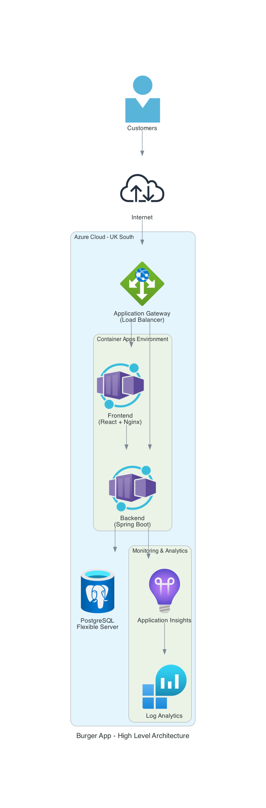
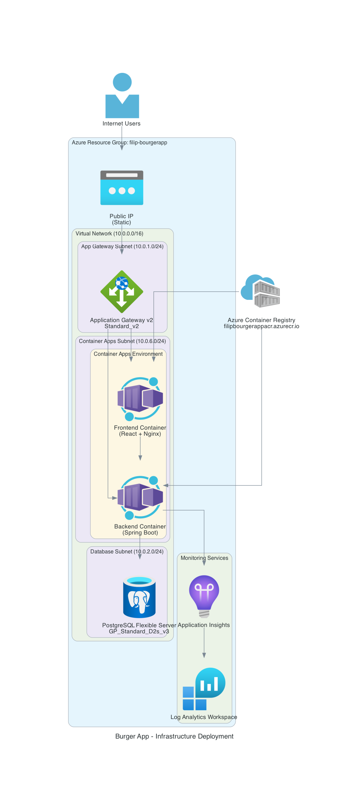
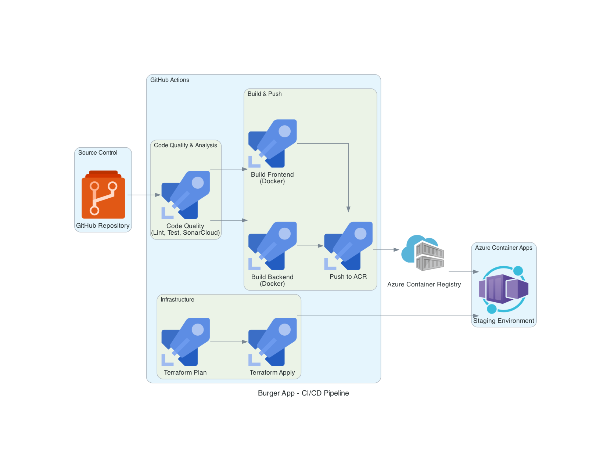
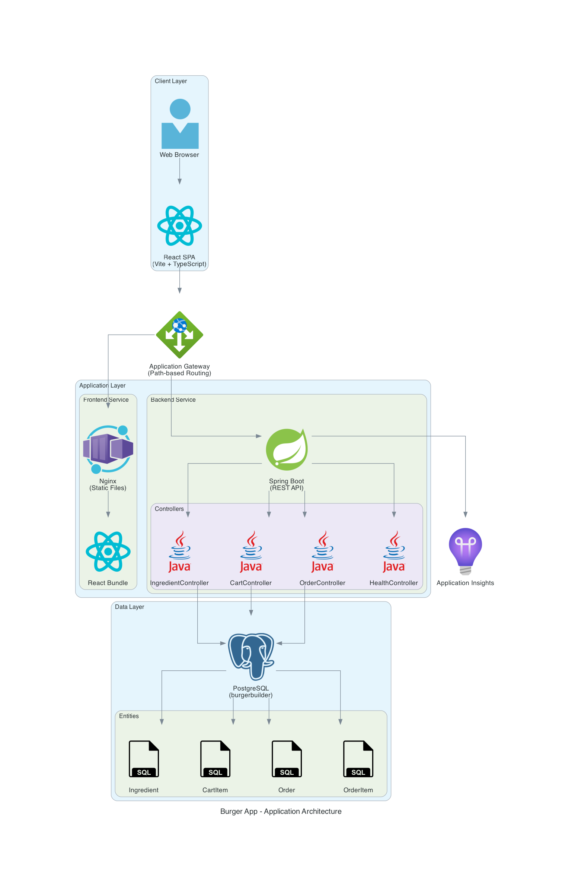
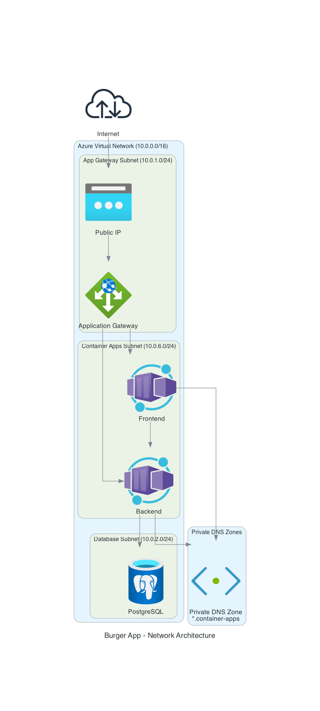
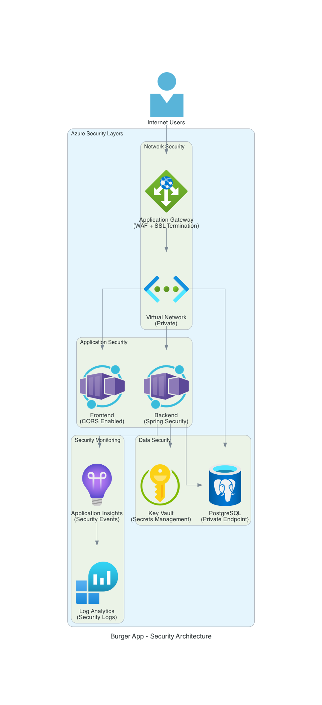

# Burger App - Architecture Diagrams

## Overview

The Burger App is a full-stack web application deployed on Azure Cloud (UK South region) using modern cloud-native architecture patterns. The solution consists of:

- **Frontend**: React SPA with TypeScript and Vite
- **Backend**: Spring Boot REST API (Java 21)
- **Database**: PostgreSQL Flexible Server
- **Infrastructure**: Terraform-managed Azure resources
- **CI/CD**: GitHub Actions pipelines

---

## 1. High-Level Architecture



### Description
This diagram shows the overall system architecture from a 10,000-foot view. It illustrates how customers interact with the application through the internet, how traffic flows through Azure Application Gateway, and how the containerized applications communicate with the database and monitoring services.

### Key Components:
- **Users**: External customers accessing the burger builder application
- **Application Gateway**: Azure's Layer 7 load balancer handling HTTP/HTTPS traffic
- **Frontend Container**: React SPA served by Nginx
- **Backend Container**: Spring Boot REST API
- **PostgreSQL**: Managed database service
- **Monitoring**: Application Insights and Log Analytics for observability

---

## 2. Infrastructure Deployment



### Description
This diagram provides a detailed view of the Azure infrastructure deployment, showing the network topology, subnet segmentation, and resource placement. It demonstrates how resources are organized within the Azure Resource Group and how they communicate through the Virtual Network.

### Network Architecture:
- **Virtual Network**: 10.0.0.0/16 CIDR block
  - **App Gateway Subnet**: 10.0.1.0/24 (Public-facing)
  - **Container Apps Subnet**: 10.0.6.0/24 (Private)
  - **Database Subnet**: 10.0.2.0/24 (Private with service delegation)

### Key Resources:
- **Resource Group**: `filip-bourgerapp`
- **Application Gateway**: Standard_v2 SKU with path-based routing
- **Container Apps Environment**: Consumption workload profile
- **PostgreSQL Flexible Server**: GP_Standard_D2s_v3 SKU with 128GB storage
- **Azure Container Registry**: `filipbourgerappacr.azurecr.io`

### Security Features:
- Private endpoints for database access
- Network isolation using subnets
- Service delegation for PostgreSQL
- Internal load balancer for Container Apps

---

## 3. CI/CD Pipeline



### Description
This diagram illustrates the complete CI/CD pipeline implemented using GitHub Actions. It shows the automated workflow from code commit to production deployment, including quality gates, build processes, and infrastructure provisioning.

### Pipeline Stages:

#### 1. Code Quality & Analysis
- **Linting**: Java (Spotless) and TypeScript/React (ESLint)
- **Testing**: JUnit tests for backend, Vitest for frontend
- **Code Coverage**: JaCoCo for Java, Istanbul for TypeScript
- **Static Analysis**: SonarCloud integration for code quality metrics

#### 2. Build & Push
- **Backend Build**: Maven-based Docker image build
- **Frontend Build**: Vite-based Docker image build with Nginx
- **Container Registry**: Push to Azure Container Registry
- **Image Tagging**: Git SHA for versioning + latest tag

#### 3. Infrastructure as Code
- **Terraform Plan**: Validate infrastructure changes
- **Terraform Apply**: Deploy infrastructure updates
- **State Management**: Remote state in Azure Storage
- **Environment**: Staging environment deployment

### Workflow Triggers:
- Push to `master` branch
- Pull requests to `master`
- Manual workflow dispatch

---

## 4. Application Architecture



### Description
This diagram shows the internal application architecture, detailing the layers, components, and data flow within the system. It provides insight into how the frontend and backend interact and how data is persisted.

### Architecture Layers:

#### Client Layer
- **Web Browser**: User interface
- **React SPA**: Single Page Application built with Vite and TypeScript
  - React Router for navigation
  - Context API for state management
  - Axios for API communication

#### API Gateway Layer
- **Application Gateway**: Path-based routing
  - `/` → Frontend (static files)
  - `/api/*` → Backend (REST API)

#### Application Layer

**Frontend Service**:
- Nginx web server
- React bundle (optimized production build)
- Environment-specific configuration

**Backend Service**:
- Spring Boot application (Java 21)
- REST Controllers:
  - `IngredientController`: Manage burger ingredients
  - `CartController`: Shopping cart operations
  - `OrderController`: Order management
  - `HealthController`: Health checks and actuator endpoints

#### Data Layer
- **PostgreSQL Database**: `burgerbuilder`
- **Entities**:
  - `Ingredient`: Available burger ingredients
  - `CartItem`: User shopping cart items
  - `Order`: Completed orders
  - `OrderItem`: Individual items within orders
  - `BurgerLayer`: Burger composition
  - `OrderLayer`: Order item composition

#### Monitoring
- Application Insights for telemetry and performance monitoring

---

## 5. Network Architecture



### Description
This diagram focuses on the network topology and connectivity patterns. It shows how traffic flows through different network segments and how private DNS resolution works for Container Apps.

### Network Components:

#### Public Network
- **Internet**: External traffic entry point
- **Public IP**: Static IP address for Application Gateway
- **Application Gateway Subnet**: 10.0.1.0/24

#### Private Networks
- **Container Apps Subnet**: 10.0.6.0/24
  - Internal load balancer enabled
  - Service delegation to Microsoft.App/environments
  - Frontend and Backend containers
  
- **Database Subnet**: 10.0.2.0/24
  - Service delegation to Microsoft.DBforPostgreSQL/flexibleServers
  - Private endpoint for PostgreSQL
  - No public network access

#### DNS Resolution
- **Private DNS Zone**: `*.container-apps`
  - Virtual network link for name resolution
  - Wildcard A record pointing to Container Apps static IP
  - Enables internal communication between containers

### Traffic Flow:
1. Internet → Public IP → Application Gateway
2. Application Gateway → Frontend Container (internal)
3. Frontend → Backend (via private DNS)
4. Backend → PostgreSQL (via private endpoint)

---

## 6. Security Architecture



### Description
This diagram highlights the security layers and controls implemented throughout the architecture. It demonstrates defense-in-depth principles and how different security mechanisms work together.

### Security Layers:

#### Network Security
- **Application Gateway**:
  - Web Application Firewall (WAF) capability
  - SSL/TLS termination
  - DDoS protection (Azure platform)
  
- **Virtual Network**:
  - Network isolation and segmentation
  - Private subnets for application and data tiers
  - Network Security Groups (implicit)

#### Application Security
- **Frontend**:
  - CORS configuration
  - Content Security Policy headers (via Nginx)
  - Static file serving with no server-side execution
  
- **Backend**:
  - Spring Security framework
  - CORS configuration
  - Input validation using Jakarta Validation
  - Secure session management

#### Data Security
- **PostgreSQL**:
  - Private endpoint (no public access)
  - SSL/TLS encryption in transit
  - Encrypted storage at rest
  - Backup retention (configurable)
  
- **Key Vault** (Optional):
  - Secrets management
  - Certificate storage
  - Managed identities for access

#### Monitoring & Compliance
- **Application Insights**:
  - Security event logging
  - Anomaly detection
  - Performance monitoring
  
- **Log Analytics**:
  - Centralized log aggregation
  - Security log retention
  - Query and analysis capabilities
  - Alert rules for security events

### Security Best Practices Implemented:
1. **Least Privilege**: Minimal permissions for all resources
2. **Network Isolation**: Private subnets and endpoints
3. **Encryption**: In-transit and at-rest encryption
4. **Monitoring**: Comprehensive logging and alerting
5. **Identity**: Managed identities where possible
6. **Secrets Management**: No hardcoded credentials

---

## Infrastructure as Code

### Terraform Modules

The infrastructure is organized using Terraform modules for reusability and maintainability:

#### 1. Network Module (`1_modules/network`)
- Virtual Network creation
- Subnet management with service delegation
- Virtual Network peering support

#### 2. Analytics Module (`1_modules/analytics`)
- Log Analytics Workspace
- Application Insights
- Retention policies

#### 3. Container Apps Module (`1_modules/container_apps`)
- Container App Environment
- Container Apps deployment
- Private DNS integration
- Auto-scaling configuration

#### 4. PostgreSQL Module (`1_modules/flexible_postgresql`)
- Flexible Server deployment
- Private DNS zone
- Database creation
- High availability support (optional)
- Read replica support (optional)

#### 5. Application Gateway Module (`1_modules/application_gateway_v2`)
- Application Gateway v2
- Backend pools and settings
- HTTP listeners
- Path-based routing rules
- Health probes
- SSL certificate management (optional)

### Deployment Realms

**Staging Environment** (`3_realms/bourgerapp/staging`):
- Resource Group: `filip-bourgerapp`
- Location: UK South
- Environment-specific variables
- Terraform state management

---

## Technology Stack

### Frontend
- **Framework**: React 18
- **Language**: TypeScript
- **Build Tool**: Vite
- **Routing**: React Router v6
- **HTTP Client**: Axios
- **Testing**: Vitest + React Testing Library
- **Web Server**: Nginx (production)

### Backend
- **Framework**: Spring Boot 3.x
- **Language**: Java 21
- **Build Tool**: Maven
- **Database Access**: Spring Data JPA
- **Validation**: Jakarta Validation
- **Testing**: JUnit 5 + Mockito
- **Monitoring**: Spring Boot Actuator

### Database
- **Engine**: PostgreSQL 16
- **Deployment**: Azure Flexible Server
- **Storage**: Premium SSD (P30)
- **Compute**: GP_Standard_D2s_v3

### Infrastructure
- **IaC**: Terraform 1.9.5
- **Cloud Provider**: Microsoft Azure
- **Container Registry**: Azure Container Registry
- **Orchestration**: Azure Container Apps

### CI/CD
- **Platform**: GitHub Actions
- **Code Quality**: SonarCloud
- **Container Build**: Docker BuildKit
- **Deployment**: Terraform

---

## Deployment Architecture Decisions

### Why Azure Container Apps?
- **Serverless**: No infrastructure management
- **Cost-Effective**: Pay only for what you use
- **Auto-Scaling**: Automatic scaling based on demand
- **KEDA Integration**: Event-driven scaling
- **Simplified Networking**: Built-in ingress and service discovery

### Why Application Gateway v2?
- **Path-Based Routing**: Single entry point for frontend and backend
- **WAF Capability**: Web application firewall for security
- **SSL Termination**: Centralized certificate management
- **Health Probes**: Automatic backend health monitoring
- **Auto-Scaling**: Scale based on traffic patterns

### Why PostgreSQL Flexible Server?
- **Flexibility**: More control over configuration
- **Performance**: Better performance than Single Server
- **Cost**: Optimized pricing model
- **High Availability**: Built-in HA options
- **Backup**: Automated backup and point-in-time restore

### Why Terraform?
- **Infrastructure as Code**: Version-controlled infrastructure
- **Modularity**: Reusable modules for different environments
- **State Management**: Track infrastructure state
- **Plan Before Apply**: Preview changes before deployment
- **Multi-Cloud**: Potential for multi-cloud deployments

---

## Monitoring and Observability

### Application Insights
- Request telemetry
- Dependency tracking
- Exception tracking
- Custom metrics
- Distributed tracing

### Log Analytics
- Centralized logging
- Custom queries (KQL)
- Alerting rules
- Workbooks for visualization
- Long-term retention

### Health Checks
- Backend: `/actuator/health`
- Frontend: `/` (Nginx default page)
- Database: Connection pool monitoring

---

## Scalability Considerations

### Horizontal Scaling
- **Frontend**: Auto-scale based on HTTP requests
- **Backend**: Auto-scale based on CPU/memory/HTTP requests
- **Database**: Read replicas for read-heavy workloads

### Vertical Scaling
- Container Apps: Adjust CPU/memory per container
- Database: Change SKU for more compute/storage
- Application Gateway: Adjust capacity units

### Performance Optimization
- CDN for static assets (future enhancement)
- Database connection pooling
- Caching layer (Redis - future enhancement)
- Query optimization and indexing

---

## Disaster Recovery

### Backup Strategy
- **Database**: Automated daily backups with 7-day retention
- **Point-in-Time Restore**: Up to 7 days
- **Geo-Redundant Backup**: Optional for production

### High Availability
- **Application Gateway**: Zone-redundant deployment option
- **Container Apps**: Multi-replica deployment
- **Database**: High availability with standby replica

### Recovery Procedures
1. Database restore from backup
2. Infrastructure recreation via Terraform
3. Container image redeployment from ACR
4. DNS updates if needed

---

## Cost Optimization

### Current Configuration (Staging)
- Application Gateway: Standard_v2 (1 capacity unit)
- Container Apps: Consumption plan
- PostgreSQL: GP_Standard_D2s_v3 (2 vCores)
- Storage: P30 Premium SSD (128GB)

### Cost Optimization Strategies
1. **Auto-Scaling**: Scale to zero when not in use (Container Apps)
2. **Reserved Instances**: Commit to 1-3 year terms for compute
3. **Right-Sizing**: Monitor and adjust resource allocation
4. **Storage Tiering**: Use appropriate storage tiers
5. **Development Environments**: Use smaller SKUs for non-production

---

## Future Enhancements

### Short-Term
- [ ] Implement Azure Key Vault for secrets management
- [ ] Add SSL/TLS certificates to Application Gateway
- [ ] Configure custom domain names
- [ ] Implement Redis cache for session management
- [ ] Add Azure CDN for static assets

### Medium-Term
- [ ] Multi-region deployment for disaster recovery
- [ ] Implement Azure Front Door for global load balancing
- [ ] Add Azure Monitor alerts and dashboards
- [ ] Implement automated database backups to separate storage
- [ ] Add API Management for API gateway features

### Long-Term
- [ ] Migrate to Azure Kubernetes Service (AKS) for more control
- [ ] Implement service mesh (Istio/Linkerd)
- [ ] Add event-driven architecture with Azure Event Grid
- [ ] Implement CQRS pattern for scalability
- [ ] Add machine learning for personalized recommendations

---

## Regenerating Diagrams

To regenerate the architecture diagrams:

```bash
# Ensure diagrams library is installed
pip install diagrams

# Run the diagram generation script
python3 diagram.py
```

This will generate all 6 architecture diagrams in PNG format.

---

## Contact and Support

For questions or issues related to the architecture:
- Review the Terraform code in `Infra/IaaC/`
- Check GitHub Actions workflows in `.github/workflows/`
- Review application code in `backend/` and `frontend/`

---